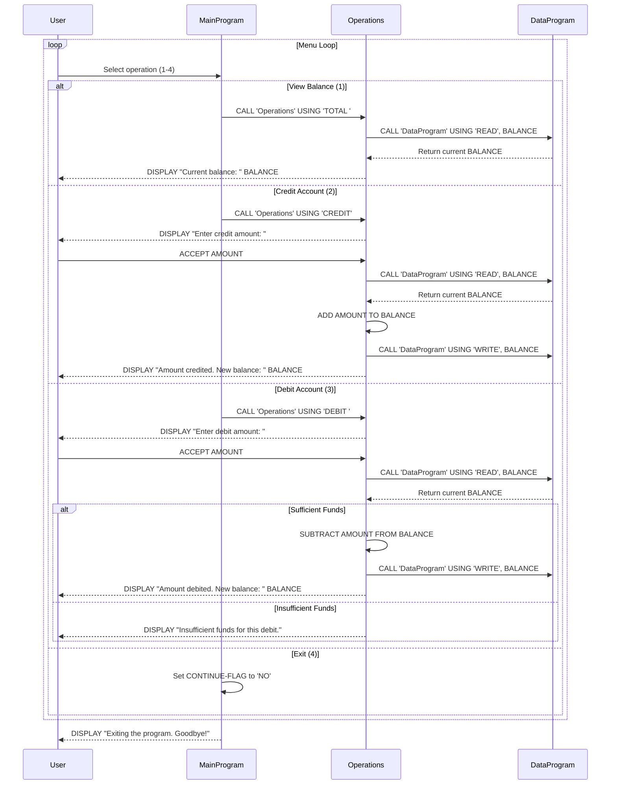

# COBOL Student Account Management System

This project contains a legacy COBOL-based system for managing student accounts. The system allows basic account operations including viewing balance, crediting funds, and debiting funds with balance validation.

## COBOL Files Overview

### data.cob
**Purpose**: Handles persistent data storage and retrieval for account balances.

**Key Functions**:
- Stores the current account balance in working storage
- Provides read/write operations for balance data
- Acts as a data access layer for the account balance

**Business Rules**:
- Maintains a single account balance initialized to $1000.00
- Supports atomic read and write operations to prevent data corruption

### main.cob
**Purpose**: Main entry point and user interface for the account management system.

**Key Functions**:
- Displays an interactive menu system
- Accepts user input for account operations
- Routes user choices to appropriate operation handlers
- Manages program flow and exit conditions

**Business Rules**:
- Provides a simple command-line interface for student account management
- Supports four main operations: view balance, credit, debit, and exit

### operations.cob
**Purpose**: Implements the core business logic for account operations.

**Key Functions**:
- `TOTAL`: Displays the current account balance
- `CREDIT`: Adds funds to the account
- `DEBIT`: Subtracts funds from the account with validation

**Business Rules**:
- **Initial Balance**: All student accounts start with $1000.00
- **Credit Operations**: Any positive amount can be credited to the account
- **Debit Operations**:
  - Only allowed if sufficient funds are available
  - Prevents overdrafts by checking balance before debit
  - Displays error message for insufficient funds
- **Balance Validation**: Ensures account balance never goes negative
- **Data Persistence**: All balance changes are immediately saved to storage

## System Architecture

The system follows a modular design with three main components:
1. **Main Program** (`main.cob`): User interface and program control
2. **Operations Module** (`operations.cob`): Business logic implementation
3. **Data Module** (`data.cob`): Data persistence layer

Communication between modules is handled through COBOL CALL statements and linkage sections, allowing for modular development and maintenance.

## Usage

To run the system:
1. Compile all COBOL programs
2. Execute the main program (`main.cob`)
3. Follow the on-screen menu prompts

## Business Context

This system appears to be designed for managing student financial accounts, such as:
- Student loan disbursements (credits)
- Tuition payments (debits)
- Account balance inquiries
- Basic financial transaction processing

The system enforces strict balance controls to prevent negative account balances, which is critical for student account management to avoid debt accumulation.

## Sequence Diagram

The following sequence diagram illustrates the data flow for account operations in the system:

